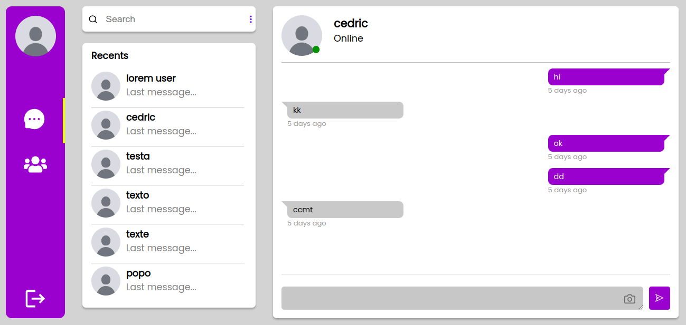

# Realtime chat app(easyChat)
This application built using Node.js, Express, Socket.io, Mongoose, RESTful Web Service.

## Features
 <li>Uses Express as the application Framework.</li> 
  <li>Real-time communication between a client and a server using Socket.io.</li>
  <li>Uses MongoDB, Mongoose  for storing messages and querying data.</li>
  <li>Uses RESTful Web Service for serve different platforms</li> 
----------------
## Installation
### Running Locally
Make sure you have Node.js and npm install.

  1. Clone or Download the repository 
    <pre>git clone https://github.com/alexissengangabo07/MERN-chat-app.git
    $ cd MERN-chat-app</pre>
  2. You need to to run client/ and server/ server so you need to open two terminal tabs 
    <pre>$ cd server</pre>
    <pre>$ cd client</pre>
  3. Install Dependencies in each tab
      <pre>npm install</pre>
  4. MongoDB start for need <pre>mongod</pre>command  from a different terminal.
  
----------------
## Run servers
Start the Application
     <li><pre>nodemon index.js</pre>
     and
     <pre>npm start</pre></li>
Application runs from localhost:3000 and backend run at localhost:5000.
----------------
## Environments variables

----------------
## Endpoints
